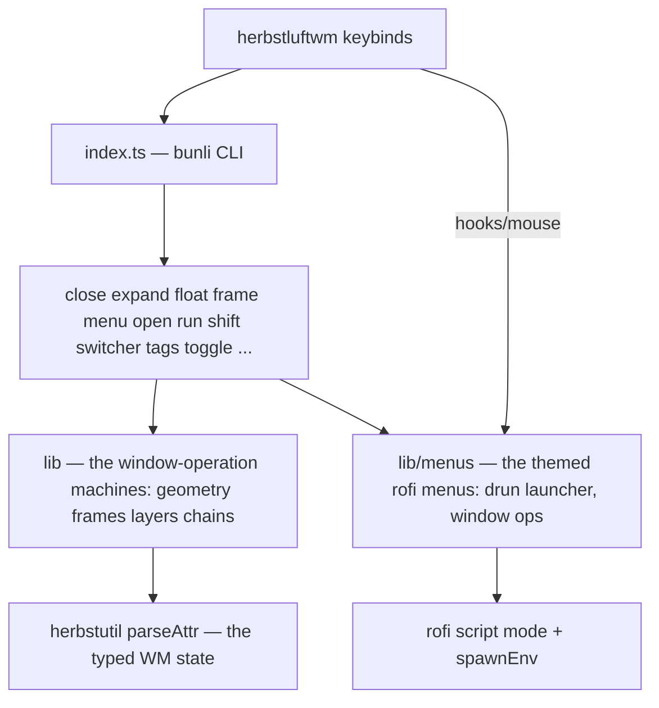
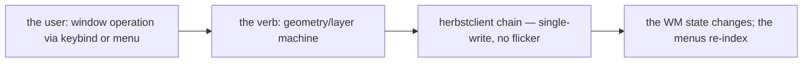

# polyframes — structural + logical

## structural

```mermaid
graph TD
    HLWM[herbstluftwm keybinds] --> IDX[index.ts — bunli CLI]
    IDX --> CMDS[close expand float frame menu open run shift switcher tags toggle ...]
    CMDS --> MACHINES[lib — the window-operation machines: geometry frames layers chains]
    CMDS --> MENUS[lib/menus — the themed rofi menus: drun launcher, window ops]
    MACHINES --> HU[herbstutil parseAttr — the typed WM state]
    MENUS --> ROFI[rofi script mode + spawnEnv]
    HLWM -->|hooks/mouse| MENUS
```

## logical

```mermaid
flowchart LR
    U[the user: window operation via keybind or menu] --> V[the verb: geometry/layer machine]
    V --> H[herbstclient chain — single-write, no flicker]
    H --> W[the WM state changes; the menus re-index]
```
